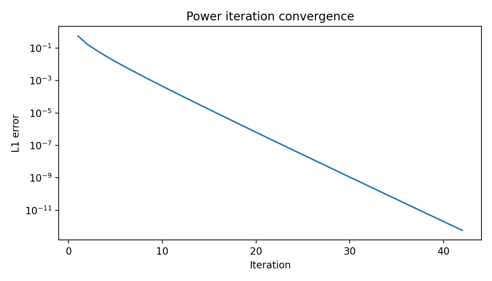
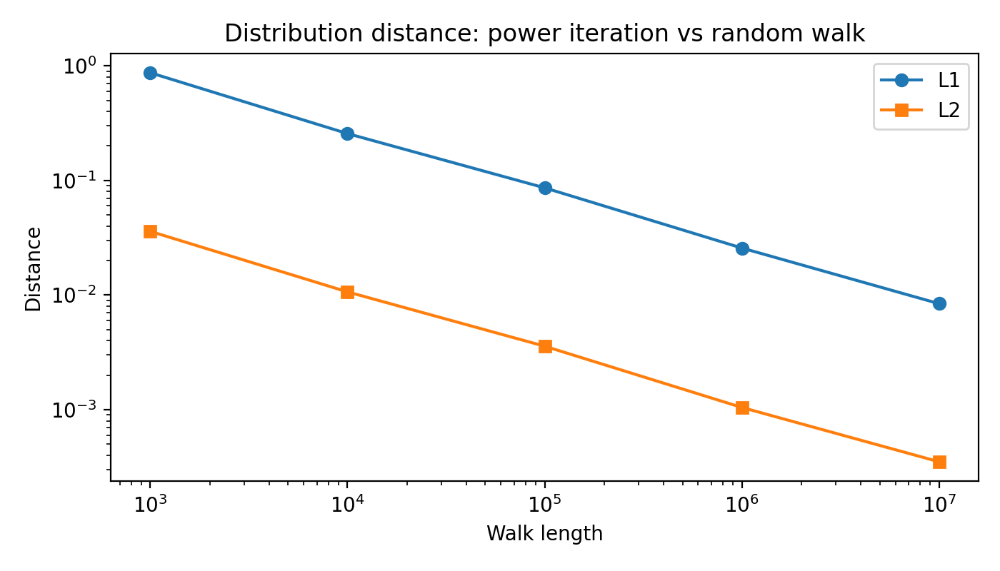
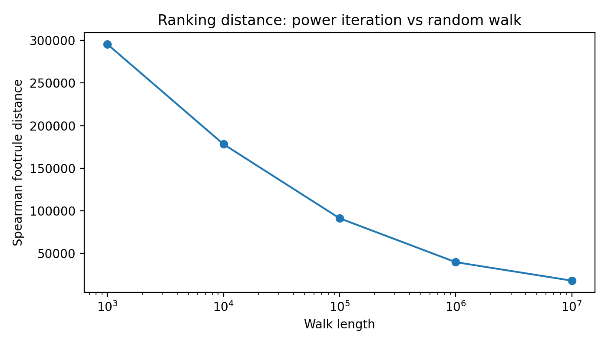

# PageRank: Modeling and Simulation

**Author:** 
Cotton(Chinese name:郭登Guo Deng)
Robin（Chinese name:张之逸 Zhang Zhiyi)  
**Student ID:** 
125260910032
124260910075  

---

##  Abstract

This report studies the probabilistic modeling and numerical implementation of PageRank by viewing it as a Markov chain on a graph, and compares the rankings obtained by power iteration and random-walk simulation.

Following the assignment, we construct the transition matrix \(M=\alpha P+(1-\alpha)\Delta\) on a fixed random graph, with \(\alpha=0.85\), and then compute the stationary distribution \(\pi_m\) and the empirical visit-frequency vectors \(\pi_s^n\).

According to the experimental results, as the random-walk length increases from \(10^3\) to \(10^7\), the \(L^1\) distance between \(\pi_s^n\) and \(\pi_m\) decreases from 0.8693 to 0.0084, the \(L^2\) distance decreases from 0.0360 to 0.00035, and the Spearman footrule distance decreases from 295520 to 18080, showing that the random-walk result steadily approaches the power-iteration result.

---

##  Introduction

PageRank is a classical model behind Google’s early web ranking algorithm, and its core idea is to model hyperlink structure as a random walk and use long-run visit frequency to measure node importance.

The assignment notes that if we only consider the original random walk on the graph, isolated nodes or closed subgraphs may appear, so the transition matrix may fail to be irreducible and may not directly guarantee a well-defined global ranking.

 
To address this issue, PageRank adds a random-jump component to the original random walk, leading to a modified Markov chain, which is the core of the present modeling and implementation.

---

##  Model Definition

Let the graph contain \(N\) nodes, and define \(N_{ij}=1\) if there is a directed edge from node \(i\) to node \(j\), and \(N_{ij}=0\) otherwise.

 
Define the out-degree of node \(i\) by \(N_i=\sum_{j\ne i}N_{ij}\); then the transition probability of the original random walk is \(p_{ij}=N_{ij}/N_i\).

 
The assignment requires using the modified matrix \(\Delta\), whose diagonal entries are 0 and off-diagonal entries are all \(1/(N-1)\), and constructing the PageRank transition matrix as follows.

\[
M=\alpha P+(1-\alpha)\Delta
\]

  
Here, \(\alpha=0.85\) is the empirically chosen parameter specified in the assignment.

The intuition of this modification is that, with probability \(\alpha\), the walker follows graph links, and with probability \(1-\alpha\), it jumps to any node other than the current one, thereby mitigating issues caused by disconnected graph structure.

---

## Theoretical Background

PageRank can be interpreted as a stationary-distribution problem for a finite-state Markov chain, and the stationary distribution characterizes the long-run frequencies with which the random walk visits nodes.

If we denote the stationary distribution by \(\pi\), then it satisfies \(\pi M=\pi\), with nonnegative entries summing to 1.

 
Power iteration approximates the stationary distribution by repeatedly updating \(\pi^{(t+1)}=\pi^{(t)}M\), while the random-walk approach provides a Monte Carlo estimate of the same distribution via long-run visit frequencies.

 
Therefore, the goal of this assignment is not only to compute a PageRank vector, but also to compare the error, stability, and ranking consistency of the two methods under finite computation budgets.

---

## Experimental Design

Following the assignment, all experiments in this report are carried out on a fixed random graph with about 1000 nodes.

To ensure reproducibility, the random seed is fixed and the same graph instance is used throughout the assignment.

The random-walk lengths are set to \(10^3\), \(10^4\), \(10^5\), \(10^6\), and \(10^7\), exactly as required by the assignment.

To compare the ranking results, this report adopts the Spearman footrule distance as the permutation distance and also reports the \(L^1\) and \(L^2\) distances between probability vectors.

---

## Implementation

### Power Iteration
  
Power iteration starts from an initial distribution \(\pi^{(0)}\) and repeatedly multiplies by the transition matrix until the difference between successive iterates becomes sufficiently small.

In this experiment, the \(L^1\) error over the first 10 iterations decreases rapidly from 0.5685 to 0.000450, showing a clear convergence trend.

The final vector is denoted by \(\pi_m\), representing the stationary distribution estimated by power iteration.

### Random Walk Simulation
 
The random-walk method directly simulates a trajectory on the graph, records how many times each node is visited, and divides by the total number of steps to obtain an empirical frequency vector.

For each length \(10^n\), we denote the empirical frequency vector by \(\pi_s^n\).
  
According to the experimental results, the distance between \(\pi_s^n\) and \(\pi_m\) continuously decreases as the number of steps increases, indicating that the random-walk frequencies gradually approach the stationary distribution.

---

## Ranking Comparison

The assignment requires sorting each PageRank vector in decreasing order of its entries, thereby constructing node permutations \(\sigma_m\) and \(\sigma_s^n\).

If \(r_1(i)\) and \(r_2(i)\) denote the ranks of node \(i\) in two permutations, then the Spearman footrule distance is defined as

\[
F(\sigma_1,\sigma_2)=\sum_{i=1}^{N}|r_1(i)-r_2(i)|
\]

A smaller value of this distance indicates that the two methods produce more consistent rankings.
  
In this experiment, this distance decreases gradually from 295520 to 18080, indicating that the ranking produced by random walk becomes increasingly close to the one obtained by power iteration as the walk length grows.

---

## Experimental Results

### Convergence Behavior
 
The first 10 power-iteration errors are shown in the table below.

| Iteration | \(L^1\) error |
|---|---:|
| 1 | 0.5684780504 |
| 2 | 0.1729562889 |
| 3 | 0.0725087720 |
| 4 | 0.0316271358 |
| 5 | 0.0149069764 |
| 6 | 0.0071404197 |
| 7 | 0.0035427902 |
| 8 | 0.0017531029 |
| 9 | 0.0008927194 |
| 10 | 0.0004503905 |
  
The table shows that the error decays rapidly during the first iterations, which indicates that the power-iteration method has good numerical stability under the current graph and parameter setting.

**Figure 1:** `pagerank_power_convergence.png`  

###  Distribution Error

The distances between the empirical distributions \(\pi_s^n\) and the power-iteration result \(\pi_m\) for different random-walk lengths are shown below.

| Walk length | \(L^1(\pi_s^n,\pi_m)\) | \(L^2(\pi_s^n,\pi_m)\) | Spearman footrule |
|---|---:|---:|---:|
| \(10^3\) | 0.8693344731 | 0.0359538147 | 295520 |
| \(10^4\) | 0.2561685046 | 0.0106591301 | 178188 |
| \(10^5\) | 0.0861381085 | 0.0035796687 | 91256 |
| \(10^6\) | 0.0257114780 | 0.0010462890 | 39774 |
| \(10^7\) | 0.0084093728 | 0.0003513277 | 18080 |
 
The results show a clear monotone decrease in all three distances as the random-walk length increases.
  
This indicates that longer random walks provide more stable empirical frequency estimates and bring both the distribution-level and ranking-level results closer to those of power iteration.

**Figure 2:** `pagerank_distribution_distance.png`  

**Figure 3:** `pagerank_ranking_distance.png`  

###  Top-Ranked Nodes

The top 20 nodes obtained by power iteration and their PageRank scores are listed below.

| Rank | Node | PageRank score |
|---|---:|---:|
| 1 | 0 | 0.0132576567 |
| 2 | 8 | 0.0094837241 |
| 3 | 5 | 0.0089200340 |
| 4 | 7 | 0.0078544781 |
| 5 | 10 | 0.0073730117 |
| 6 | 6 | 0.0066530992 |
| 7 | 16 | 0.0066316058 |
| 8 | 18 | 0.0062632042 |
| 9 | 12 | 0.0060169181 |
| 10 | 21 | 0.0058671409 |
| 11 | 3 | 0.0049061374 |
| 12 | 37 | 0.0044049283 |
| 13 | 17 | 0.0041727998 |
| 14 | 14 | 0.0041525834 |
| 15 | 19 | 0.0041432098 |
| 16 | 68 | 0.0040025855 |
| 17 | 1 | 0.0039980859 |
| 18 | 23 | 0.0039786213 |
| 19 | 20 | 0.0039375726 |
| 20 | 24 | 0.0037783766 |
 
From the ranking results, node 0 has the highest PageRank value, equal to 0.01326, which is noticeably larger than that of the subsequent nodes.

The top 10 nodes are 0, 8, 5, 7, 10, 6, 16, 18, 12, and 21, and this ordering serves as the main reference for comparison with the random-walk results.

### Top-10 Consistency
 
The Top-10 ranking obtained by power iteration is always `[0, 8, 5, 7, 10, 6, 16, 18, 12, 21]`.

When the walk length is \(10^3\), the Top-10 from random walk is `[8, 16, 0, 38, 392, 7, 129, 5, 215, 183]`, which differs substantially from the power-iteration result.

When the walk length reaches \(10^4\), the random-walk Top-10 becomes `[0, 8, 7, 5, 10, 18, 16, 21, 6, 12]`, which is already very close to the power-iteration ranking.

From \(10^5\) to \(10^7\), the random-walk Top-10 is essentially stable at `[0, 8, 5, 7, 10, 16, 6, 18, 12, 21]`, differing from the power-iteration ranking only by a swap between positions 6 and 7.

This shows that the identification of top nodes becomes quite reliable at moderate walk lengths, while small order differences among nearby ranks require longer trajectories to stabilize fully.

---

## Discussion

The central conclusion of this experiment is that power iteration provides a stable reference PageRank vector, while the random-walk method is noisy for short trajectories and gradually approaches the same reference as the walk becomes sufficiently long.
  
This is especially clear in the distribution distances: the \(L^1\) distance decreases by roughly a factor of 100, and the \(L^2\) distance falls to the order of \(10^{-4}\).
  
At the ranking level, the Spearman footrule decreases from 295520 to 18080, showing that random walk approaches power iteration not only numerically but also structurally in terms of the overall ranking.
  
It is especially notable that from \(10^5\) onward, the random-walk Top-10 is almost identical to that of power iteration, with only a swap between the 6th and 7th positions.

This suggests that for the task of identifying the most important nodes, a medium-length random walk is already effective; however, if the goal is to recover the full ranking precisely, a longer trajectory is still necessary.
 
From the computational viewpoint, power iteration is a deterministic method that updates the whole vector at each step and is therefore better suited as a high-accuracy reference solution, whereas random walk is a sampling-based method better suited for probabilistic interpretation and approximate estimation.

---

##  Conclusion

This report implemented the PageRank Markov-chain model as required by the assignment and compared two solution strategies: power iteration and random-walk simulation.

The experimental results show that power iteration converges quickly and yields stable results, whereas the random-walk method gradually approaches the power-iteration result as the number of steps increases.

Specifically, from \(10^3\) to \(10^7\), both the distribution error and the permutation error continuously decrease, and the Top-10 ranking evolves from being clearly inconsistent to being almost identical.
 
Therefore, for graphs of finite size, power iteration is better suited as an accurate computational method, while random walk is better understood as a probabilistic interpretation and a sampling-based approximation method.

---
